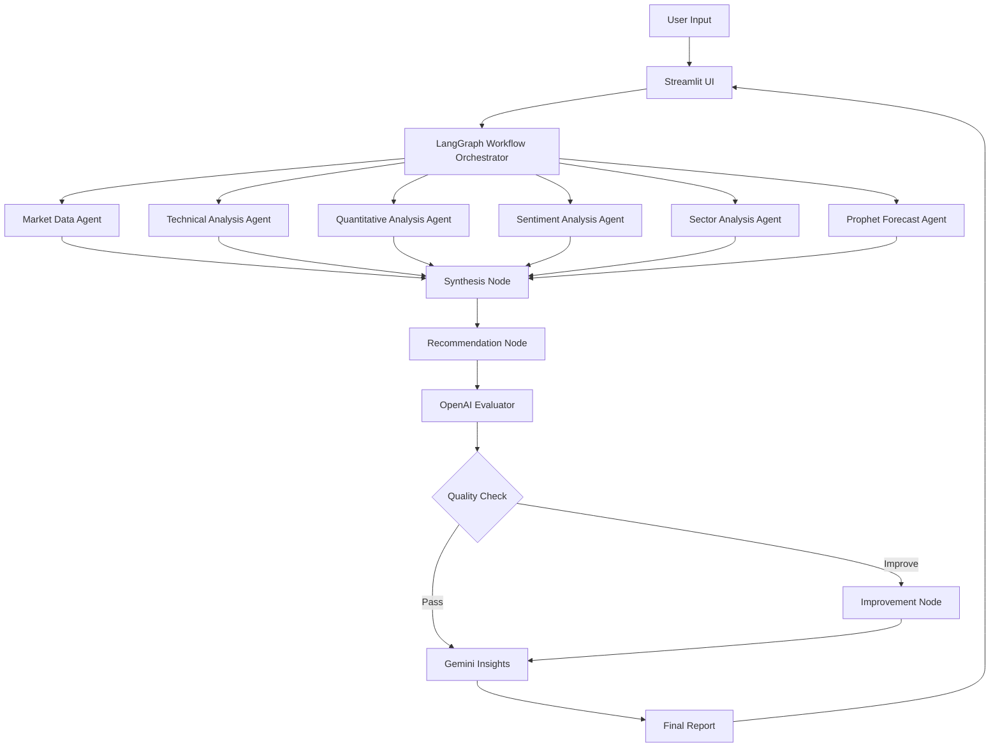

<div align="center">

# 📈 Multi Agent Financial Analysis System

> A powerful AI-driven financial analysis platform powered by LangGraph, featuring 8 specialized agents for comprehensive stock market analysis.

---

**🎓 Academic Project Submission**  
**University of San Diego**  
**MS in Applied Artificial Intelligence**  
**Natural Language Processing and GenAI (AAI-520-IN2)**  

[](https://streamlit.io)
[](https://www.python.org/downloads/)


</div>


---
## Webapp Demo


---

## 🌟 Features

### 📊 Comprehensive Analysis
- **Single Stock Analysis** - Deep dive into individual stocks with multi-agent analysis
- **Multi-Stock Comparison** - Compare multiple stocks side-by-side
- **Analysis History** - Track and review past analyses

### 🤖 8 Specialized AI Agents

| Agent | Purpose | Technology |
|-------|---------|------------|
| 🔍 **Market Data Agent** | Fetches real-time stock data, fundamentals, and valuation metrics | Yahoo Finance |
| 📈 **Technical Analysis Agent** | Calculates RSI, SMAs (20/50/200), trend detection, and volatility | Custom indicators |
| 📊 **Quantitative Analysis Agent** | Risk assessment, Sharpe ratio, max drawdown, volatility analysis | NumPy, Pandas |
| 💭 **Sentiment Analysis Agent** | Analyzes market sentiment from news and social media | NewsAPI |
| 🏢 **Sector Analysis Agent** | Sector performance comparison and industry trends | Yahoo Finance |
| 🔮 **Prophet Forecast Agent** | 30-day price predictions with confidence intervals | Facebook Prophet |
| 🧠 **OpenAI Evaluator** | Quality assessment and analysis improvement suggestions | GPT-4o-mini |
| ✨ **Gemini Insights Generator** | Natural language insights and actionable recommendations | Google Gemini |

### 📉 Advanced Visualizations
- **Interactive Plotly Charts** - Zoom, pan, and explore data with smooth animations
- **Technical Indicators Chart** - Price trends with SMA 20, 50, 200 overlays
- **3-Panel Forecast View** - Forecast, historical comparison, and trend components
- **Risk Assessment Dashboard** - Visual risk metrics and performance indicators

### 🔐 Flexible API Key Management
- **Streamlit Cloud Secrets** - Secure deployment with encrypted secrets
- **Manual Input** - Enter keys directly in the UI sidebar
- **Environment Variables** - Local development with .env files
- **3-Tier Priority System** - Automatic fallback between configuration methods

### 🚀 Dual Architecture
- **Streamlit UI** - Beautiful, interactive web interface
- **FastAPI Backend** - RESTful API for programmatic access

---

## 🏗️ Architecture



---

## 🛠️ Technology Stack

### Core Framework
- **LangGraph** - Workflow orchestration and agent coordination
- **LangChain** - LLM integration framework

### Frontend
- **Streamlit** - Interactive web UI
- **Plotly** - Interactive data visualizations

### Backend
- **FastAPI** - RESTful API server
- **Uvicorn** - ASGI server

### AI/ML
- **OpenAI GPT-4o-mini** - Analysis evaluation
- **Google Gemini** - Insights generation
- **Facebook Prophet** - Time series forecasting

### Data & Analysis
- **yfinance** - Real-time stock data
- **pandas** - Data manipulation
- **numpy** - Numerical computing

---

## 📋 Prerequisites

### Required
- **Python 3.10+**
- **OpenAI API Key** - [Get it here](https://platform.openai.com/api-keys)
- **Google Gemini API Key** - [Get it here](https://aistudio.google.com/app/apikey)

### Optional (for enhanced features)
- **NewsAPI Key** - [Get it here](https://newsapi.org/register)
- **FRED API Key** - [Get it here](https://fred.stlouisfed.org/docs/api/api_key.html)
- **Alpha Vantage Key** - [Get it here](https://www.alphavantage.co/support/#api-key)

---

## 🚀 Quick Start

### 1. Clone the Repository

```bash
git clone https://github.com/YOUR_USERNAME/multi-agent-financial-analysis.git
cd multi-agent-financial-analysis
```

### 2. Create Virtual Environment

```bash
# Create virtual environment
python -m venv .venv

# Activate virtual environment
# On macOS/Linux:
source .venv/bin/activate
# On Windows:
.venv\Scripts\activate
```

### 3. Install Dependencies

```bash
pip install -r requirements.txt
```

### 4. Configure API Keys

**Option A: Using Streamlit Secrets (Recommended for deployment)**

```bash
# Copy the secrets template
cp .streamlit/secrets.toml.example .streamlit/secrets.toml

# Edit the file and add your API keys
nano .streamlit/secrets.toml
```

**Option B: Using Environment Variables (Local development)**

```bash
# Create .env file
touch .env

# Add your API keys
echo "OPENAI_API_KEY=your_openai_key_here" >> .env
echo "GOOGLE_API_KEY=your_gemini_key_here" >> .env
```

**Option C: Manual Input**

Simply enter your API keys in the Streamlit sidebar when the app launches.

### 5. Run the Application

**Streamlit UI:**
```bash
streamlit run ui/streamlit_app.py
```

The app will open at `http://localhost:8501`

**FastAPI Server (optional):**
```bash
python api/main.py
```

API docs available at `http://localhost:8000/docs`

---

## 📱 Usage

### Analyzing a Stock

1. **Launch the app** using `streamlit run ui/streamlit_app.py`
2. **Configure API keys** in the sidebar (if not using secrets)
3. **Enter a stock symbol** (e.g., AAPL, GOOGL, TSLA)
4. **Click "Analyze"**
5. **Explore the results** across 7 tabs:
   - 📝 **Recommendation** - Investment advice and overall score
   - 📊 **Market Data** - Valuation metrics, profitability ratios
   - 📈 **Technical Analysis** - RSI, SMAs, trend indicators with interactive chart
   - 📊 **Quantitative** - Risk metrics, Sharpe ratio, volatility
   - 🔮 **Forecast** - 30-day price predictions with 3 interactive charts
   - 💭 **Sentiment** - News sentiment and market mood
   - 🏢 **Sector Info** - Industry analysis and peer comparison

### Multi-Stock Comparison

1. Navigate to **"Multi-Stock Comparison"** page
2. Enter multiple stock symbols separated by commas
3. Compare metrics side-by-side

### Viewing History

1. Navigate to **"Analysis History"** page
2. Review past analyses
3. Export results if needed

---

## 📊 Sample Analysis Output

### Investment Recommendation
```
Symbol: AAPL
Recommendation: BUY
Overall Score: 0.72/1.0
Risk Level: MEDIUM

Strengths:
✅ Strong technical indicators (RSI: 45.2)
✅ Positive forecast: +5.3% expected in 30 days
✅ High profit margin (25.3%)

Risk Factors:
⚠️ Market volatility increased (28.5%)

AI Insights:
"Apple demonstrates strong fundamentals with consistent profitability
and positive technical momentum. The forecast suggests moderate upside
potential with manageable risk levels..."
```

---

## 🗂️ Project Structure

```
multi-agent-financial-analysis/
├── 📁 app/
│   ├── 📁 agents/
│   │   ├── market_data.py      # Market data fetching
│   │   ├── technical.py         # Technical indicators
│   │   ├── quantitative.py      # Risk analysis
│   │   ├── sentiment.py         # Sentiment analysis
│   │   ├── sector.py            # Sector comparison
│   │   ├── forecast.py          # Prophet forecasting
│   │   ├── evaluator.py         # OpenAI evaluation
│   │   └── insights.py          # Gemini insights
│   ├── 📁 core/
│   │   ├── config.py            # Configuration management
│   │   ├── state.py             # LangGraph state definition
│   │   └── workflow.py          # LangGraph workflow
│   └── 📁 utils/
│       └── validators.py        # API key validators
├── 📁 ui/
│   ├── streamlit_app.py         # Main Streamlit app
│   └── 📁 components/
│       ├── single_stock.py      # Single stock analysis
│       ├── multi_stock.py       # Multi-stock comparison
│       └── history.py           # Analysis history
├── 📁 api/
│   └── main.py                  # FastAPI server
├── 📁 .streamlit/
│   └── secrets.toml.example     # Secrets template
├── requirements.txt             # Python dependencies
├── .gitignore                   # Git ignore rules
├── DEPLOYMENT.md                # Deployment guide
└── README.md                    # This file
```

---

## 🔑 API Keys Configuration

### Required Keys

| Service | Purpose | Link | Priority |
|---------|---------|------|----------|
| OpenAI | Analysis evaluation | [Get Key](https://platform.openai.com/api-keys) | ⚠️ Required |
| Google Gemini | Insights generation | [Get Key](https://aistudio.google.com/app/apikey) | ⚠️ Required |

### Optional Keys

| Service | Purpose | Link | Priority |
|---------|---------|------|----------|
| NewsAPI | Enhanced sentiment analysis | [Get Key](https://newsapi.org/register) | 🟢 Optional |
| FRED | Economic data | [Get Key](https://fred.stlouisfed.org/docs/api/api_key.html) | 🟢 Optional |
| Alpha Vantage | Additional market data | [Get Key](https://www.alphavantage.co/support/#api-key) | 🟢 Optional |

### Configuration Priority

The system uses a 3-tier priority system:

1. **Streamlit Secrets** (Highest) - For cloud deployment
2. **Session State** - Manual input via UI
3. **Environment Variables** - Local .env file

---

## 🚀 Deployment

### Deploy to Streamlit Cloud

[](https://share.streamlit.io)

**Quick Deploy:**

1. Push your code to GitHub
2. Go to [share.streamlit.io](https://share.streamlit.io)
3. Click "New app" and select your repository
4. Set main file: `ui/streamlit_app.py`
5. Configure secrets in "Advanced settings"
6. Click "Deploy!"

**Detailed instructions:** See [DEPLOYMENT.md](DEPLOYMENT.md)

---

## 📈 Performance

### Analysis Speed
- **Market Data**: ~2-3 seconds
- **Technical Analysis**: ~1-2 seconds
- **Quantitative Analysis**: ~1-2 seconds
- **Sentiment Analysis**: ~3-5 seconds
- **Sector Analysis**: ~2-3 seconds
- **Prophet Forecast**: ~30-60 seconds (most time-consuming)
- **Total Average**: ~60-90 seconds per stock

### Optimization Tips
- Use `@st.cache_data` for repeated analyses
- Consider caching Prophet models
- Batch API calls when possible

---

## 🤝 Contributing

We welcome contributions! Here's how you can help:

### Ways to Contribute
- 🐛 Report bugs
- 💡 Suggest new features
- 📝 Improve documentation
- 🔧 Submit pull requests

### Development Setup

```bash
# Fork and clone the repository
git clone https://github.com/YOUR_USERNAME/multi-agent-financial-analysis.git

# Create a new branch
git checkout -b feature/your-feature-name

# Make your changes and test

# Commit with clear messages
git commit -m "Add: description of your changes"

# Push to your fork
git push origin feature/your-feature-name

# Open a Pull Request
```

### Code Style
- Follow PEP 8 guidelines
- Add docstrings to all functions
- Include type hints where appropriate
- Write unit tests for new features

---

## 🐛 Known Issues

- **Prophet Forecasting**: Can be slow for first-time analysis (30-60 seconds)
- **NewsAPI**: Limited to 100 requests/day on free tier
- **Rate Limits**: API rate limits may affect rapid successive analyses

---

## 📝 Changelog

### Version 3.0.0 (Current)
- ✨ Added Quantitative Analysis agent
- 🎨 Migrated all visualizations to Plotly
- 📈 Added interactive price trend chart to Technical Analysis
- 🔐 Implemented Streamlit Cloud secrets support
- 📚 Created comprehensive deployment documentation
- 🐛 Fixed deprecation warnings in pandas

### Version 2.0.0
- 🤖 Integrated LangGraph workflow orchestration
- ⚡ Added OpenAI Evaluator agent
- ✨ Added Gemini Insights Generator
- 🎨 Enhanced UI with multi-page navigation

### Version 1.0.0
- 🚀 Initial release
- 📊 5 core analysis agents
- 🖥️ Basic Streamlit UI
- 🔌 FastAPI backend

---

## 🧪 Testing

### Run Tests

```bash
# Install test dependencies
pip install pytest pytest-cov

# Run tests
pytest tests/

# Run with coverage
pytest --cov=app tests/
```

### Manual Testing Checklist

- [ ] Load Streamlit app successfully
- [ ] API keys validate correctly
- [ ] Analyze stock (e.g., AAPL)
- [ ] All 7 tabs display data
- [ ] Charts render and are interactive
- [ ] Multi-stock comparison works
- [ ] History page shows past analyses

---

## 📄 License

This project is licensed under the MIT License - see the [LICENSE](LICENSE) file for details.

---

## 🙏 Acknowledgments

### Technologies
- [LangGraph](https://github.com/langchain-ai/langgraph) - Workflow orchestration
- [Streamlit](https://streamlit.io/) - Web framework
- [OpenAI](https://openai.com/) - GPT-4 API
- [Google Gemini](https://ai.google.dev/) - Gemini API
- [Prophet](https://facebook.github.io/prophet/) - Time series forecasting
- [yfinance](https://github.com/ranaroussi/yfinance) - Stock data

### Inspiration
Built with the goal of democratizing access to professional-grade financial analysis tools.

---

## 📞 Support

### Documentation
- [API Documentation](http://localhost:8000/docs) (when running FastAPI)


---

## ⚠️ Disclaimer

**This tool is for educational and informational purposes only. It does not constitute financial advice.**

- Always do your own research (DYOR)
- Past performance does not guarantee future results
- Consult with a qualified financial advisor before making investment decisions
- The creators are not responsible for any financial losses

---

### 📞 Contact & Collaboration

**Project Team - Group 4**

🔹 **Sourangshu Pal** - Senior Visual Computing Engineer  
📧 Email: spal@sandiego.edu  
🔗 LinkedIn: sourangshu.pal  
🐙 GitHub: [sourangshupal](https://github.com/sourangshupal)

🔹 **Riyaz Khorasi** - Senior Data Scientist  
📧 Email: rkhorasi@sandiego.edu 
🔗 LinkedIn: riyazkhorasi  
🐙 GitHub: [riyazkhorasi](https://github.com/Riyazmk1995)

🔹 **Prashant Khare** - Lead AI Systems Architect 
📧 Email: tanvisingh@sandiego.edu
🔗 LinkedIn: tanvisingh  
🐙 GitHub:  [https://github.com/tanvisingh-11](https://github.com/tanvisingh-11)

**Academic Institution**  
🎓 **University of San Diego**  
📚 MS in Applied Artificial Intelligence Program  
📖 Course: Introduction to Artificial Intelligence  
👨‍🏫 Professor: [Ankur Bist]  
📅 Academic Year: [2025]

---

### 🙏 Acknowledgments

We extend our heartfelt gratitude to:

- **University of San Diego Faculty**: For providing exceptional education and guidance in artificial intelligence
- **Course Instructors**: For inspiring us to tackle meaningful challenges and push the boundaries of our knowledge
- **Classmates & Peers**: For collaborative learning and mutual support throughout our academic journey
- **Open Source Community**: For providing the foundational tools and libraries that made this project possible

---

<div align="center">

### 💖 Made with Love by Group 4

**Sourangshu Pal • Riyaz Khorasi • Tanvi Singh**

**University of San Diego | MS Applied Artificial Intelligence**

**Natural Language Processing and GenAI (AAI-520-IN2) | 2025**

---

*"Advancing financial systems through artificial intelligence, one breakthrough at a time."*

---

⭐ **If this project inspires your work, please consider starring our repository!** ⭐

</div>
